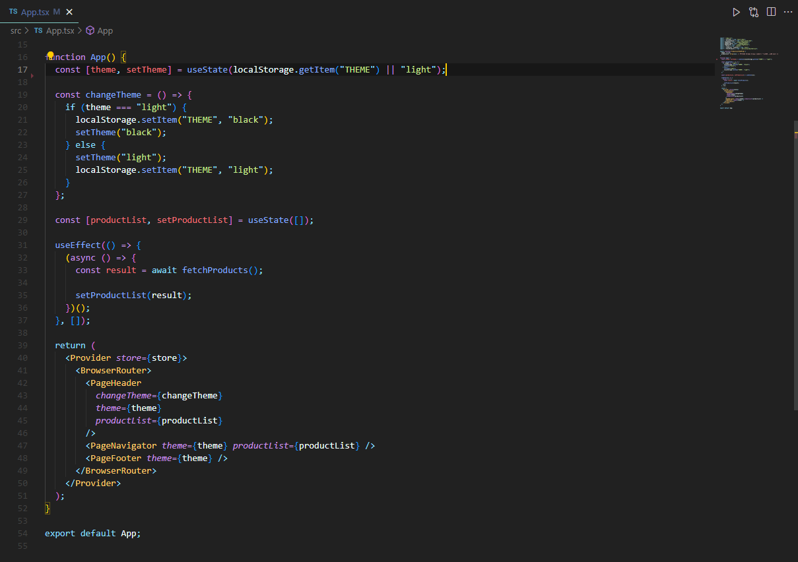

# ReactShop

기술 스택 (Front): React.js TypeScript Redux-Toolkit Styled-component 
깃허브 링크: https://github.com/umsungjun/React-Shop--TS 
배포 링크: https://react-shop-ts-hazel.vercel.app/ 
주제: React와 TypeScript를 사용하여 Fake Store API 데이터를 활용하여 만든 쇼핑몰 프로젝트 입니다. 
진행 기간: 2023년 3월 2일 → 2023년 3월 12일 
프로젝트 종류: 개인프로젝트

## 프로젝트 소개

React와 TypeScript를 이용하여 구현한 쇼핑몰 프로젝트 입니다.

컴포넌트 기반의 개발 방식과 TypeScript의 정적 타입 검사 기능을 활용하여 개발 생산성을 높혔습니다. 또한, Redux Toolkit을 이용하여 전역 상태를 효율적으로 관리하였으며, 이를 통해 상태의 변화를 간편하게 관리하는 법을 습득했습니다.

## 기능 구현

### Light / Dark 테마

- 기능 소개 : Header의 Theme 버튼(아이콘)을 통해서 Light 또는 Dark 테마를 적용할 수 있습니다.
- 기능 구현 : Redux를 이용하여 테마의 전역 상태를 간결하게 관리하는 방법도 있지만 props를 이용해서 전역 상태를 관리할 때 어떻게 상위 컴포넌트에서 하위 컴포넌트로 props를 통해서 전달하는 과정에 대해서 알고싶어서 props를 이용해서 구현하였습니다.

  

App.tsx에서 theme의 state를 관리하였습니다. 또한 App component가 랜더링 되었을 때 localStorage에서 “THEME” key 값으로 가져온 값이 없다면 Light모드로 기본값을 주었습니다.

### 장바구니 기능

- 기능 소개 : 상품 상세 페이지에서 장바구니에 담기 버튼을 클릭했을 때 장바구니의 상품이 담김과 동시에 Header에 상품 개수가 올라가는 기능입니다.
- 기능 구현 : Header에 노출되는 상품 개수는 Redux Toolkit을 이용하였습니다. conterSlice 함수의 reducer를 이용해서 증가, 감소, 리셋 함수를 사용했습니다.

  

Header에서는 const count = useSelector((state: RootState) => state.counter.value); useSelector를 이용해서 현재 상태의 value를 받아왔습니다.

### 검색 기능

- 기능 소개 : 사용자가 Header SearchBar에 검색어를 입력하면, 해당 검색어와 일치하는 상품들의 리스트가 자동으로 표시되어, 사용자가 더욱 편리하게 원하는 상품을 찾을 수 있도록 도와주는 기능입니다.
- 기능 구현 : 사용자가 Header SearchBar에 검색어를 입력하면, 해당 검색어를 filterProduct() 함수에 전달합니다. filterProduct() 함수는 productList라는 배열에서 검색어와 일치하는 상품들만 추출해 새로운 배열을 생성합니다. 이 때, 검색어와 상품명을 비교할 때, 대소문자 구분 없이 일치하는 것을 찾기 위해 검색어와 상품명 모두 소문자로 변환해 줍니다. 그리고 filter 함수를 사용하여 검색어와 일치하는 상품들만 추출합니다. filter 함수를 통해 추출된 상품들의 배열을 이용하여, React의 map 함수를 이용해 각 상품의 정보를 가지고 있는 component를 렌더링합니다. 이를 통해, 사용자가 입력한 검색어와 일치하는 상품들을 리스트 형태로 보여줄 수 있습니다.

  

 

## 이슈

### 이슈 1

- 이슈 : Header에서 보이는 장바구니에 담긴 상품의 개수를 전역적으로 어떻게 관리해야 할지에 대한 고민이 있었습니다.
- 해결 방법 : 페이지 상단의 Header에 보여지는 장바구니에 담긴 상품의 개수를 전역적으로 관리하기 위해 Redux Toolkit을 이용하였습니다. 이를 위해, 카트에 담긴 상품의 개수를 관리하는cartCounterSlice.ts를 생성하였습니다.

  

                                                                                    App.tsx

Redux를 사용하기 위해, React 애플리케이션에 Provider라는 컴포넌트를 이용하여 Redux store를 전역적으로 사용할 수 있도록 설정하였습니다.

  

 

로컬스토리지에 저장된 JSON 형태의 데이터를 가져와서 파싱하고, 가져온 값 중에서 ' ' (빈 문자열)이 아닌 값을 변수에 저장합니다. 그리고 for-in 반복문을 이용해서 parsedCartItem 변수의 키 값을 가져오고, 만약 해당 키 값을 가진 아이템이 cartItem 목록에 있다면, parsedCartItem의 해당 키 값을 이용해서 count 값을 가져오고 countSum 변수에 더해줍니다. 이렇게 더해진 값을 초기값으로 지정합니다.

그 후 counterSlice의 increment, decrement, reset 함수를 dispatch해서 장바구니의 담긴 상품의 개수를 관리합니다.

### 이슈 2

- Vercel 배포 오류

  

- 해결 방법 : 오류가 난 부분에 react-icons 뒤에 붙은 문자를 소문자로 변경하니 오류가 해결되었습니다.
- import { BsSunFill } from 'react-icons/bs'
  import { IoMdMoon } from 'react-icons/io'
